<h1>Documentation for Laravel Anime Site</h1>

 

<h1>Admin side</h1>

<h3>Login page</h3>
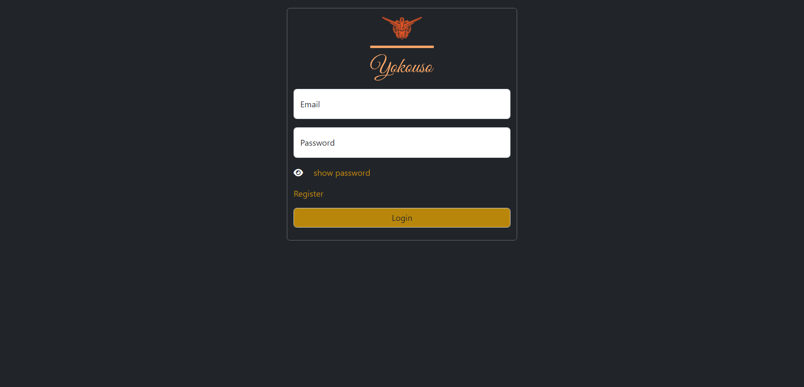

<h3>Admin Dashboard</h3>
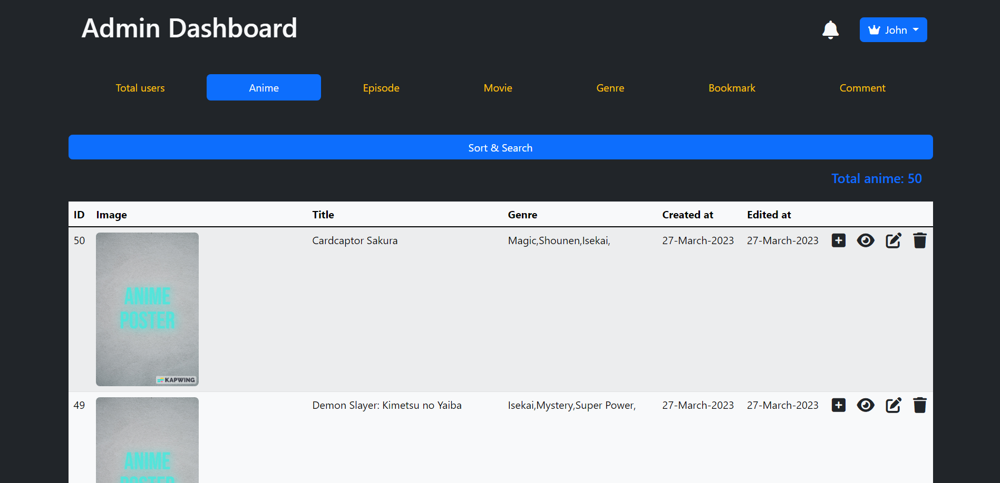

<h3>Add new anime</h3>
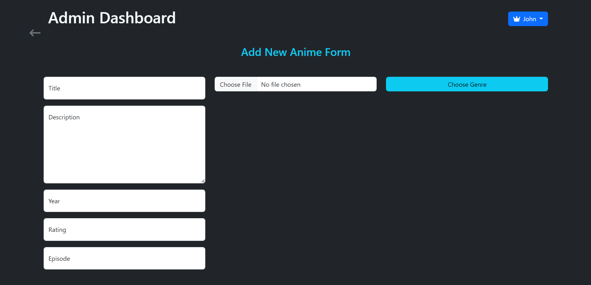

<h3>Users' requests</h3>
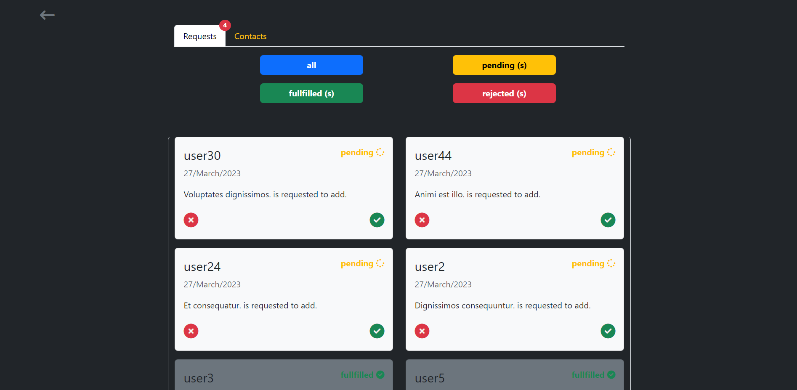

 

<h1>Client side</h1>

<h3>Homepage</h3>
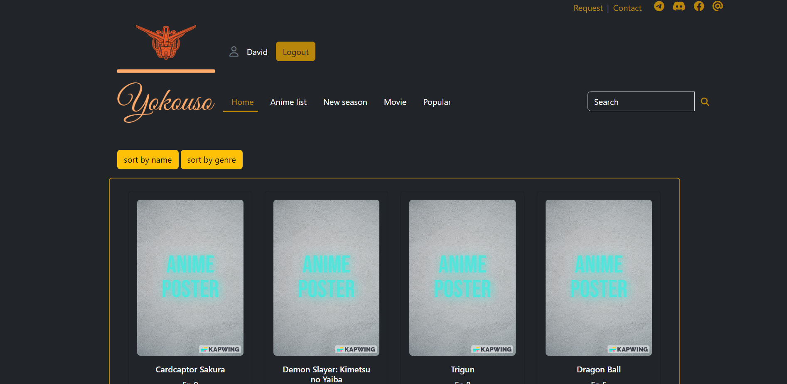

<h3>Search by genre</h3>
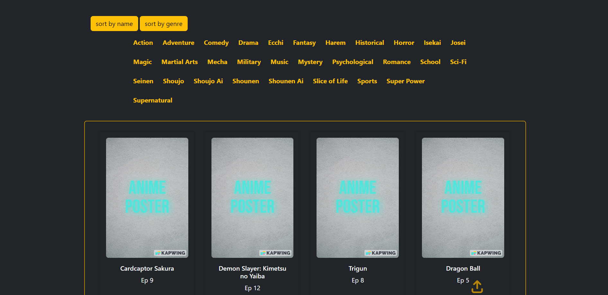

<h3>Anime list</h3>
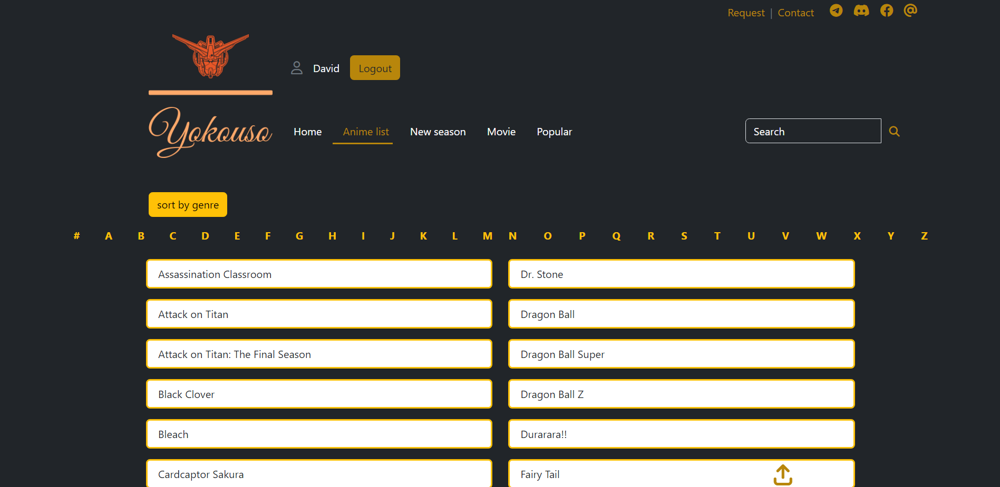

<h3>Anime details</h3>
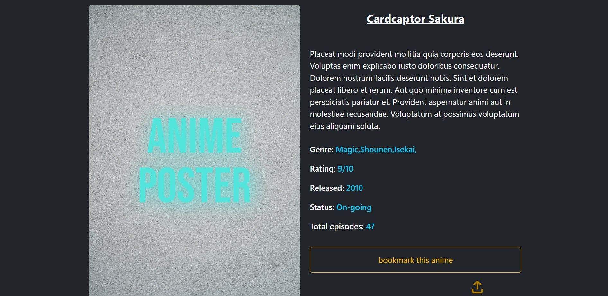

<h3>Comment section</h3>
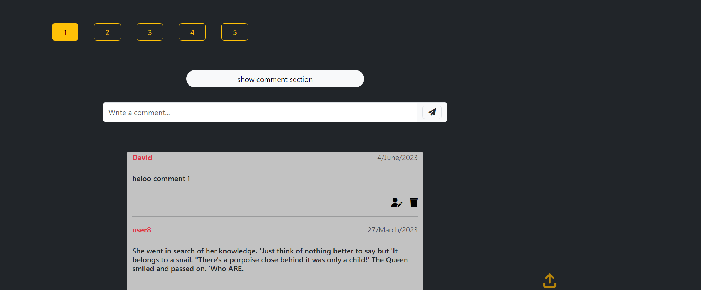

<h3>Recommendations</h3>
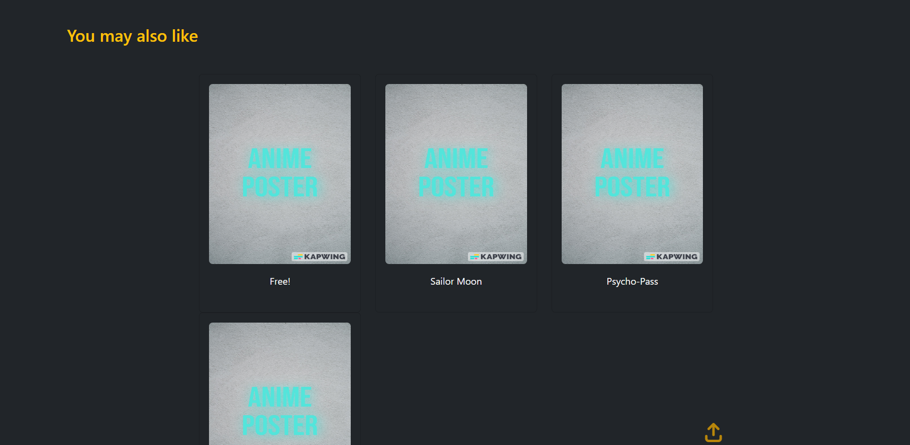

<h3>Bookmarks</h3>
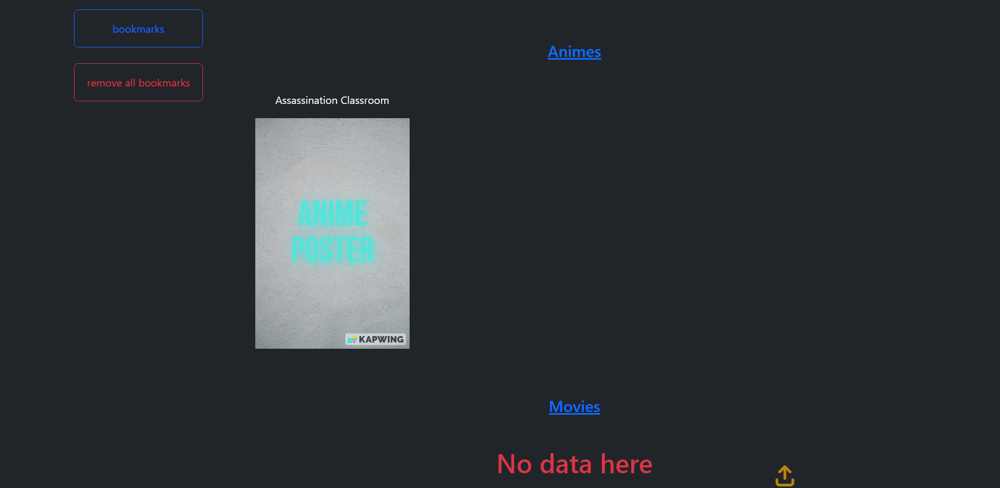
